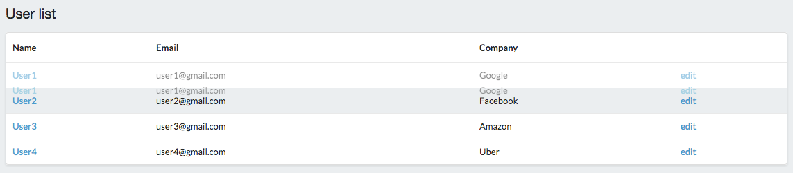

# Drag drop application with React & Redux & HTML5



## Tools

* Babel
* Webpack & webpack-dev-sever
* React Router & React Router Redux
* Redux devtool
* Semantic: UI framework

## Installation

1.Install all node modules (build into *node_modules* folder)  

```
npm install
```

2.Run

* Development Environment: Run on *webpack-dev-server*

	* Start webpack-dev-server. You can change config of server (IP, port) in *package.json*.

		```
		npm start
		```

	* Go to url

		```
		http://localhost:8080
		```

* Production Environment: Run on server (Nginx, Apache, ...)

	* Bundle all files into a javascript file. Using *path* and *filename* in *webpack.config.js* to specify the information of bundle file.

		```
		npm run build
		```

	* Include it into html.

		```
		<script type="text/javascript" src="build/js/bundle.js"></script>
		```

	* Config server and run in browser.